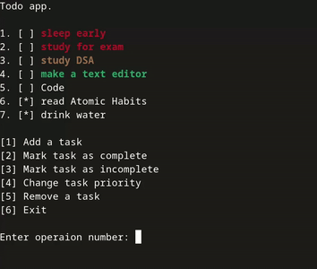

# Todo App

A simple console-based todo application written in C++ that allows users to manage their tasks efficiently. The app
provides functionalities to add, mark as complete/incomplete, and remove tasks. The menu dynamically adjusts to show or
hide options based on whether tasks exist.

## Features

- Add a new task
- Mark a task as complete
- Mark a task as incomplete
- Remove a task
- Dynamic menu options based on task list

<p align="center">
   
</p>

## Getting Started

### Prerequisites

- C++ compiler (e.g., `g++`)
- CMake version 3.28 or higher
- Make sure you have the necessary permissions to read/write files in the directory where the app is run

### Installation

1. **Clone the repository:**
    ```sh
    git clone https://github.com/BahaaMohamed98/TodoPlusPlus.git
    cd todo-app
    ```

2. **Compile the application using CMake:**
    ```sh
    cd build
    cmake ..
    make
    ```

### Running the App

1. **Run the compiled application:**
    ```sh
    ./ToDo
    ```

2. **Follow the on-screen instructions to manage your tasks.**

## Usage

- **Add a Task:** Enter task description when prompted.
- **Mark Task as Complete/Incomplete:** Select the task number from the list.
- **Remove a Task:** Select the task number from the list.
- **Exit:** Choose the exit option to close the application.

## Code Structure

- **src/main.cpp:** Entry point of the application.
- **src/Manager.cpp:** Manages the main application logic.
- **src/TodoList.cpp:** Handles task operations.
- **src/Task.cpp:** Represents individual tasks.
- **src/FileIo.cpp:** Manages file input/output operations.
- **src/Input.cpp:** Handles user input.
- **src/Menu.cpp:** Manages the display of menu options.
- **src/include/helpers.hpp:** Utility functions and structures.